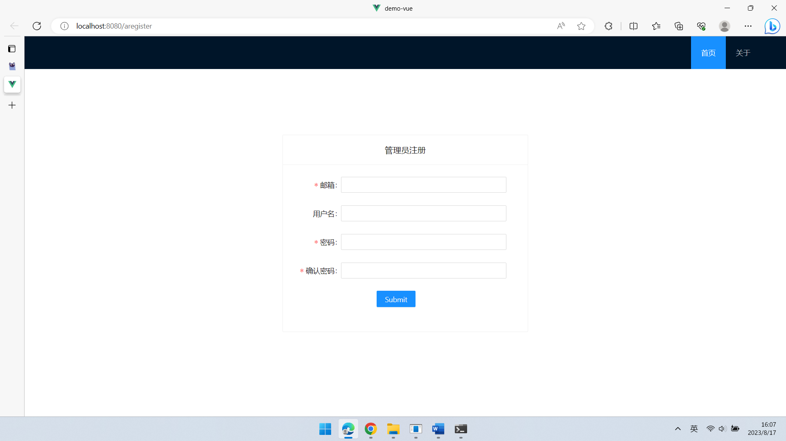

# 学生管理系统

本系统采用了Go语言Gin框架作为后端技术栈，并结合Vue3+TypeScript作为前端技术架构，构建了一个~~简单朴素~~功能强大的学生管理系统。通过该学生管理系统，管理员可以方便地进行用户登录注册、学生信息与班级信息的增删改查，以及学生信息的数据统计和分析等操作。  


## 项目地址

- 后端项目：[GitHub](https://github.com/QirongY/ManagementSystem) 
  
- 前端项目：[GitHub](https://github.com/QirongY/ManagementSystem-front) 


## 开发环境

- MySQL 8.0
  
- GoLand 2022.3.4

- Node.js  18.15.0

- npm 9.6.3  

- yarn 1.22.19  

- @vue/cli 5.0.8  


## 操作步骤

1. 分别clone前后端仓库

2. 后端项目config文件夹的application.yml文件中的相关配置需要自行修改。

   ```yml
   server:
     port: 1016
   datasource:
     driverName: mysql
     host: 127.0.0.1
     port: 3306
     database: demo
     username: root
     password: 123456
     charset: utf8
   ```

   **注意：数据库名为demo，需要自行用MySQL创建名为demo的数据库。**

3. 后端项目配置好后开启运行

4. 前端项目文件夹下打开命令行，输入

   ```shell
   yarn install
   yarn serve
   ```

5. 前往网址，localhost:8080


## 截图

### 1. 首页


### 2. 注册登录




### 3. 个人信息


### 4. 学生信息


### 5. 班级信息


### 6. 忘记密码与重置


